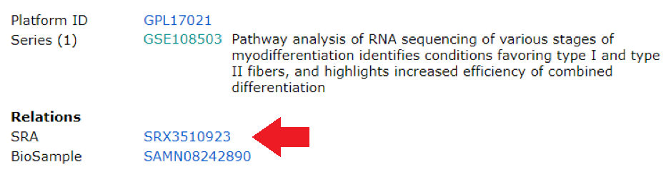
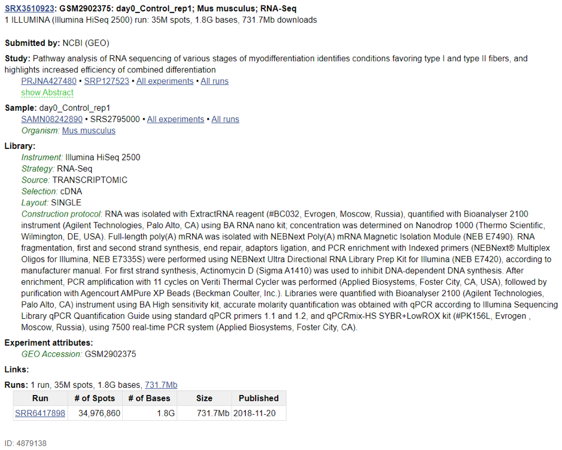
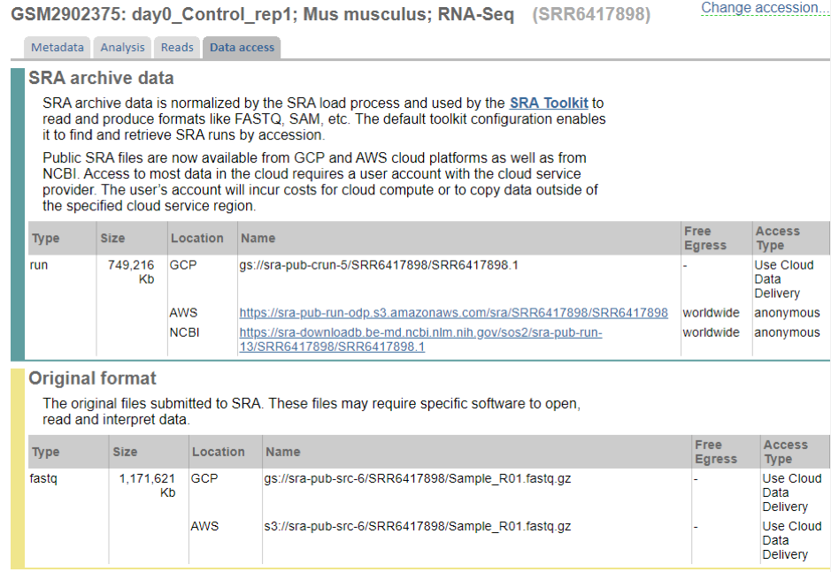
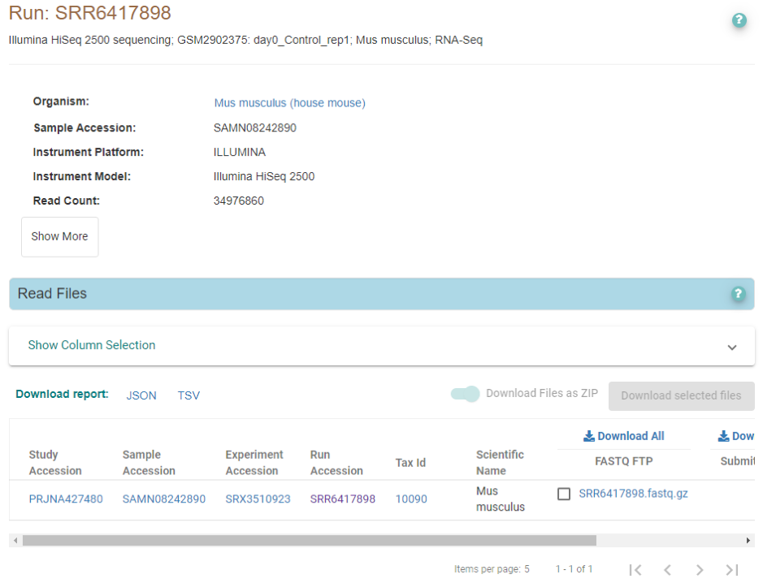
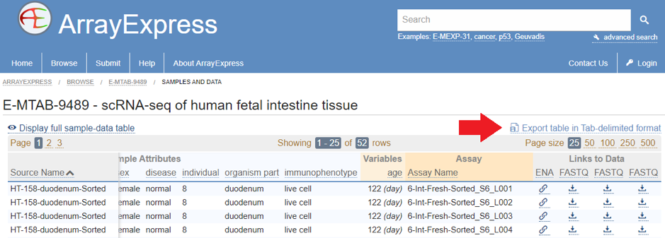
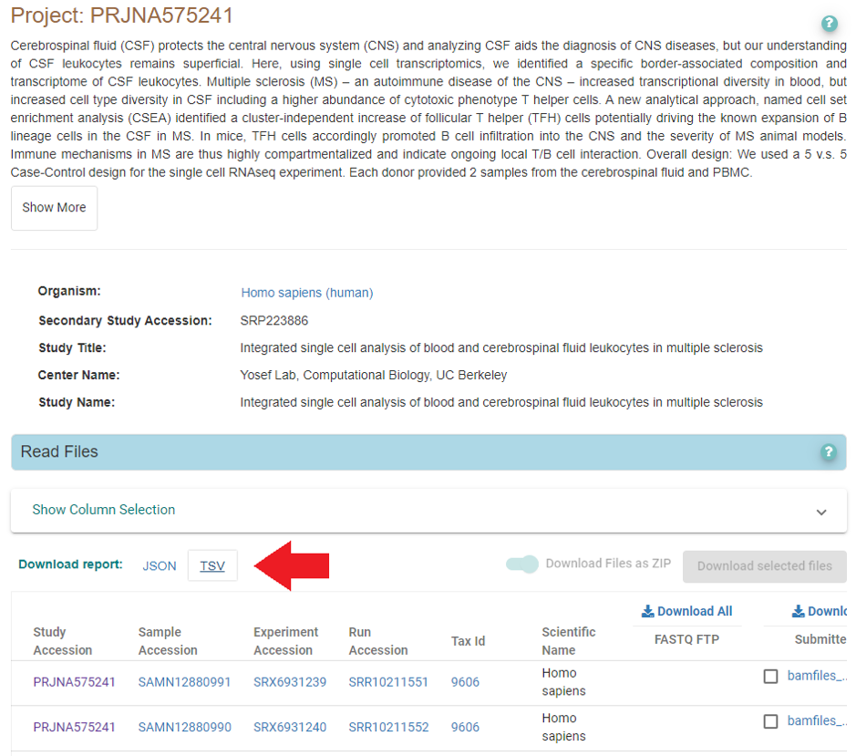

Getting raw fastq files from GEO/ArrayExpress/SRA/ENA databases
---------------------------------------------------------------
 
**Databases and manual file download**

RNA-seq and scRNA-seq data are often deposited into Gene Expression Omnibus database `GEO <https://www.ncbi.nlm.nih.gov/geo/info/>`_, 
which is maintained by NCBI. More generally, next-generation sequencing data are deposited to the Sequence Read Archive database
`SRA <https://www.ncbi.nlm.nih.gov/sra>`_. All of the GEO sequencing entries are present in SRA, but the opposite is not true. GEO datasets generally 
have a lot more metadata, and are carefully checked by curators; SRA is more of a free-for-all environment, but they also have at least some metadata. 
Some of the GEO and SRA entries are protected - you can’t access the data before a certain date or without certain permissions (e.g. dbGap).

GEO entries are organized into series that start with GSE, composed of samples, which start with GSM. Series sometimes can be split into sub-series; 
the GSE that is split into sub-series is then referred to as super-series (yes, it is stupid!). There are also GEO datasets (GDS), 
which refer to microarray samples carefully processed by NCBI curators (there are no RNA-seq GDS, but there are many microarrays). 
There are also GPL “platform IDs”, which are more meaningful for microarrays, but for RNA-seq can be useful to tell if sequencing was done using Illumina 
or something else (e.g. BGI, MGI, IonTorrent, SOLiD, etc). 

SRA entries are organized into studies (IDs start with SRP) that consist of experiments (SRX), which are in turn organized into runs (SRR).
SRR is what is actually matched to sequencing reads. Thus, if you need to download one or few samples, you can use the web interface, 
find which SRR IDs correspond to your sample, and download them using wget or a similar tool. 

**Bulk RNA-seq example:** 
`Study GSE108503 <https://www.ncbi.nlm.nih.gov/geo/query/acc.cgi?acc=GSE108503>`_ consists of 14 samples, GSM2902375 - GSM2902388. 
If you click on the first sample (GSM2902375) and scroll to the bottom of the page, you will see the following:

Clicking on the link next to SRA will get you to this page: 

From this, you can learn that the sample GSM2902375 was deposited in SRA as SRR6417898. 
Click on the SRR link on the bottom, and then on “Data Access” tab, and you’ll see the following: 

You can now copy the AWS or NCBI link and run:

  .. code-block:: bash

    wget -b https://sra-pub-run-odp.s3.amazonaws.com/sra/SRR6417898/SRR6417898
    
Which will download the file in sra format (see below). 

.. warning:: Beware: sometimes, more than 1 SRR would match to the same GSM ID. Also, SRR IDs do not always go sequentially in the same GSE dataset. 

European Bioinformatics Institute maintains similar databases - `ArrayExpress <https://www.ebi.ac.uk/arrayexpress/>`_ (similar to GEO), 
and `European Nucleotide Archive <https://www.ebi.ac.uk/ena/browser/home>`_ (similar to SRA). They have their own quirks and features - for example, 
many SRA entries are actually available via ENA, and are conveniently re-packaged as gzipped fastq files. 
For example, if we search the same SRR ID as above (SRR6417898) in ENA, we find the samples are there as well: 

Right-click will show you the fastq file full address, which you can then download similarly:

  .. code-block:: bash
     
     wget -b ftp://ftp.sra.ebi.ac.uk/vol1/fastq/SRR641/008/SRR6417898/SRR6417898.fastq.gz
 
**SRA formats and NCBI SRA tools**

In order to automate the process, we need to learn a bit about NCBI file formats and database organization. 
Raw reads are stored in the SRA database in the proprietary SRA format. In order to work with it, 
it’s good to have `sra-tools <https://github.com/ncbi/sra-tools>`_ installed, which can be done via conda:

  .. code-block:: bash

     conda install -y sra-tools
     
After you have installed it, you can unpack the previously downloaded sra file as follows: 

  .. code-block:: bash
  
     fastq-dump --split-e SRR6417898
     
Strangely enough, you don’t have to download the sra file before, and you can simply run the command above! 
Sra tools will handle the download. Sometimes it’s very slow and other options (see above) work better; sometimes it works really well 
- you might have to experiment and figure out what works best. Another potentially very fast option is 
`ascp <http://download.asperasoft.com/download/docs/scp_client/2.5/aspera-client-unix.html>`_, which can be very helpful if downloading a very large number 
of files. 

The “--split-e” option (‘--split-3” in older versions of SRA tools) makes sure that paired-end reads are written as separate files. You can also add “--origfmt” 
if you want the original Illumina-generated read names (if they are present in the sra file itself). Important note: fastq-dump sometimes quits in the middle of 
download, and there is no easy way to see it from the fastq file. We recommend saving both STDOUT and STDERR for each individual download to a separate log and 
checking that all samples downloaded correctly. This can be done as follows:

  .. code-block:: bash
     
     nohup fastq-dump --split-e SRR6417898 &> SRR6417898.fqdump.log 
 
**Automation: fetching many samples at once** 

If you’re interested in getting a whole dataset (many GSM IDs), there are several ways to do so. First of all, check if the study is present in 
ArrayExpress (see section below). Second, there’s a regularly updated metadata dump that can be downloaded from 
ftp://ftp.ncbi.nlm.nih.gov/sra/reports/Metadata/SRA_Accessions.tab (the file is ~ 10Gb in size currently!). The file contains all the GSM-to-SRR relationships 
there is; grepping the file for the GSM IDs of interest will give you the SRR IDs, which then can be downloaded using fastq-dump.

Third option includes using the following commands:

  .. code-block:: bash

     conda install -y entrez-direct
     esearch -db sra -query GSM2902375 | efetch -format runinfo
   
You should get the following output:

  .. code-block:: bash
  
    Run,ReleaseDate,LoadDate,spots,bases,spots_with_mates,avgLength,size_MB,AssemblyName,download_path,Experiment,LibraryName,LibraryStrategy,
    LibrarySelection,LibrarySource,LibraryLayout,InsertSize,InsertDev,Platform,Model,SRAStudy,BioProject,Study_Pubmed_id,ProjectID,Sample,BioSample,SampleType,
    TaxID,ScientificName,SampleName,g1k_pop_code,source,g1k_analysis_group,Subject_ID,Sex,Disease,Tumor,Affection_Status,Analyte_Type,Histological_Type,Body_Site,
    CenterName,Submission,dbgap_study_accession,Consent,RunHash,ReadHash 
    
    SRR6417898,                                                                                    2018-11-20 17:22:14,2017-12-25 
    22:07:26,34976860,1783649224,0,50,731,,https://sra-downloadb.st-va.ncbi.nlm.nih.gov/sos1/sra-pub-run-14/SRR6417898/SRR6417898.1,
    SRX3510923,,RNA-Seq,cDNA,TRANSCRIPTOMIC,SINGLE,0,0,ILLUMINA,Illumina HiSeq 2500,SRP127523,PRJNA427480,,427480,SRS2795000,SAMN08242890,simple,10090,
    Mus musculus,GSM2902375,,,,,,,no,,,,,GEO,SRA641703,,public,49D0BE5F45F4EC33F0E989FF6408B9A7,AE60F7CF5BEC932C8CCDC7BF26EAA741
    
The URL present in the 10th column of this output (separated by comma) can be used to download the sra file, which in this case will be called SRR6417898.1.

  .. code-block:: bash
  
     URL=`esearch -db sra -query GSM2902375 | efetch -format runinfo | cut -d',' -f10 | grep SRR`
     wget -b $URL
     fastq-dump --split-e SRR6417898.1

These scripts can be used to automate the download of many files. Try to not do more than 4 downloads of any kind at the same time, since you will get timeouts 
and errors. 

**Downloading single cell datasets from SRA**

Unfortunately, SRA processing is done very poorly for 10x scRNA-seq datasets, and they are often deposited as single-end files, losing the important 
read 1 that contains cell barcode and UMI. For this reason, one should download BAM files instead of SRA or fastq. The procedure here can be as follows: 

1) make a list of SRR IDs for the experiments you want to download and reprocess; after this, use the following bash script to download all of them sequentially (srapath utility is a part of entrez-direct): 

  .. code-block:: bash

     #!/bin/bash
     SRR_LIST=$1 
     COUNT=1
     for i in `cat $SRR_LIST`
        do
            BAM=`srapath $i -f names --raw -p typ=srapub_files | grep bam | cut -d '|' -f 8`
            echo "Downloading file $BAM .." 
            wget $BAM &> $i.wget.log
        done
        
2) Convert them to read files using 10x version of `bamtofastq <https://support.10xgenomics.com/docs/bamtofastq>`_; 

3) Process the resulting fastq files with STARsolo or other read aligner of choice. 

**Using ArrayExpress or ENA** 

ArrayExpress/ENA make everything easier because they have a metadata file that contains explicit URL for all gzipped fastq files, and they do not use the obscene horrific inconvenient sra format. They also do not lose the second read for 10x experiments. Let’s see the process given two examples: dataset E-MTAB-9489, and dataset GSE138266.

1) Dataset E-MTAB-9489 was submitted directly to ArrayExpress, so the reads are available in the correct format. To get them, click on “Samples and data” link, and then export the table as tab-delimited text file (marked with arrow): 

   
After this, you can parse the text file as follows to get the list of URLs for download:

 .. code-block:: bash
 
   cat sample_table.tsv | tr '\t' '\n' | grep ftp | grep fastq

This gives you an URL list that can be subsequently downloaded with wget or other similar tools.

2) Dataset GSE138266 was originally submitted to GEO, so searching ArrayExpress or ENA for it returns nothing. However, if we check the associated bio-project, SRP223886, we can see that there is an ENA entry linked to it: 

   
There are no fastq files, but the same BAM files you were finding with srapath (see above) are also available here via EBI ftp. 
Download the file marked with the arrow, get the URLs with BAM files, and download them with wget. After this, follow the steps described above 
(convert bam to fastq using 10x’s bamtofastq, and quantify the reads using STARsolo or a similar tool). 

**Brief summary**

ArrayExpress/ENA is the best way to get data - they are downloaded quickly and often are already in fastq.gz form. If you can’t find the requested data there, 
use `fastq-dump` for bulk RNA-seq, or get BAM files for 10x scRNA-seq. In the latter case, BAM file can be converted to 10x fastq files using 10x’s version of bamtofastq. Following this, you can run cellranger, STARsolo, kallisto/bustools, or alevin to obtain a counts matrix. 
