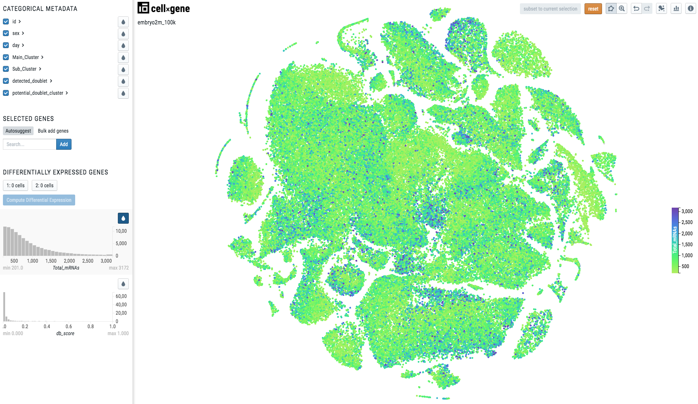

Single Cell Visualizations
==========================

Authors: `Batuhan Cakir <https://www.sanger.ac.uk/people/directory/cakir-batuhan>`_, `Simon Murray <https://www.sanger.ac.uk/people/directory/murray-simon>`_ and `Vladimir Kiselev <https://www.sanger.ac.uk/people/directory/kiselev-vladimir-yu>`_. 

If you would like to make your single-cell RNA-seq data publicly available on a website, for example as a supplement for a publication, we can help you with that!

cellxgene
---------

We use `cellxgene
<https://chanzuckerberg.github.io/cellxgene/>`_ to visualize single cell RNA-seq data. **cellxgene** is an interactive data explorer which is very scalable and flexible.

To be able for us to create a **cellxgene** website for your data we need to have your data in the `h5ad (AnnData) <https://anndata.readthedocs.io>`_ format. 

AnnData
-------

AnnData format usually contains the following slots:

- **X** contains the expression matrix.
- **obsm** contains the embeddings data.
- **obs** contains the cell metadata.
- **var** contains the gene metadata.

.. image:: img/anndata.svg
   :width: 700

When you work with **cellxgene** you only need to modify two of the slots above: **obsm** and **obs**.

X slot
^^^^^^

**cellxgene** works faster when the expression matrix is stored in ``CSC`` (compressed sparse column) format instead of ``CSR`` (compressed sparse row) format or dense Numpy array (which sometimes can create a smaller ``h5ad`` file depending on the sparsity of your data). 

To convert your expression matrix into the ``CSC`` format please use:

.. code-block:: python
    
    adata.X = scipy.sparse.csc_matrix(adata.X)

To convert your expression matrix into the Numpy array please use:

.. code-block:: python

    adata.X = scipy.sparse.csc_matrix.toarray(adata.X)

obsm slot
^^^^^^^^^

To visualize your cells in 2D **cellxgene** uses **obsm** slot. If there are multiple embeddings stored in this slot they will all be available on the web interface. 

.. note:: **cellxgene** requires that all of the embeddings' names are prefixed with ``X_``. For example, ``X_umap``, ``X_pca`` or ``X_some_embedding``.

obs slot
^^^^^^^^

To highlight and colour your cells **cellxgene** uses **obs** slot. The colouring will depend on the type of you cell metadata contained in the **obs** slot.

When the metadata is *categorical*, i.e. there is one colour per category, the visualization will look like this:

.. image:: img/categorical.png
   :width: 700

To make your cell metadata categorical please use the following code:

.. code-block:: python

    import pandas as pd
    adata.obs['metadata_name'] = pd.Categorical(adata.obs['metadata_name'])

When the metadata is *continuous*, the visualization will look like this:

.. note:: Note there is a continuous scale on the right side of the plot.

To make your cell metadata continuous please use the following code:

.. code-block:: python

    import numpy as np
    adata.obs['metadata_name'] = np.float32(adata.obs['metadata_name'])

Data Conversion
^^^^^^^^^^^^^^^

For the following code we used a dataset from `10X Genomics <https://support.10xgenomics.com/single-cell-gene-expression/datasets/3.0.0/heart_1k_v3>`_ which can be downloaded using this `link <http://cf.10xgenomics.com/samples/cell-exp/3.0.0/heart_1k_v3/heart_1k_v3_filtered_feature_bc_matrix.h5>`_. 

.. warning:: Before converting your data please make sure the **reticulate** package is installed, this can be done using the following code.

.. code-block:: r

    install.packages('reticulate')

.. warning:: Before converting, ensure the installation of **anndata** (anndata version has to be < 0.6.20) is done using the following code. 

.. code-block:: python 

    pip install anndata == 0.6.19 

or 

.. code-block:: python

    conda install anndata == 0.6.19  -c bioconda

.. warning:: Before converting, ensure the installation of **loompy** (loompy version < 3.0.0) is done using the following code.

.. code-block:: python

    pip install loompy == 2.0.17

or

.. code-block:: python

    conda install loompy == 2.0.17  -c bioconda

In order to use the sceasy functionas, make sure to load the reticulate library. The R software must also be ran in the environment you installed **loompy** and **anndata**. To ensure all this is done run the following lines of code:

.. code-block:: r
    
    library(reticulate)   
    use_condaenv('EnvironmentName')
    loompy <- reticulate::import('loompy')
    
**Seurat to Anndata (.h5ad)**

Convert a **Seurat** object ``seurat_object`` to ``h5ad`` format:

.. code-block:: r
    
   sceasy:::convertFormat(SeuratData, from="seurat", to="anndata",
                             outFile='filename.h5ad')

**Seurat to SingleCellExperiment(.rds)**

Convert a **Seurat** object ``seurat_object`` to ``rds`` format:

.. code-block:: r

   sceasy:::convertFormat(SeuratData, from="seurat", to="sce",
                            outFile='filename.rds')

**SingleCellExperiment to Anndata (.h5ad)**

Converting a **SingleCellExperiment** object ``rds`` to ``h5ad`` format:

.. code-block:: r
    
   sceasy:::convertFormat(SceData, from="sce", to="anndata", 
                            outFile='filename.h5ad')

**SingleCellExperiment to Loom (.loom)**

Convert a **SingleCellExperiment** object ``rds`` to ``loom`` format:

.. code-block:: r

   sce_loom <- sceasy:::convertFormat(SceData, from="sce", to="loom",
                                         outFile='filename.loom')

**Loom to Anndata (.h5ad)**

Convert a **Loom** object ``loom`` to ``h5ad`` format:

.. code-block:: r

   sceasy:::convertFormat('filename.loom', from="loom", to="anndata",
                             outFile='filename.h5ad')

**Loom to SingleCellExperiment (.rds)**

Convert a **Loom** object ``loom`` to ``rds`` format:

.. code-block:: r

   sceasy:::convertFormat('filename.loom', from="loom", to="sce", 
                            outFile='filename.rds')

Examples
--------

We have already created a couple of websites for some of our programme members. You can have a look at them at the following links:

| `https://www.kidneycellatlas.org <https://www.kidneycellatlas.org/>`_ 
| `https://hemocytes.cellgeni.sanger.ac.uk <https://hemocytes.cellgeni.sanger.ac.uk/>`_
| `https://melanoma.cellgeni.sanger.ac.uk <https://melanoma.cellgeni.sanger.ac.uk/>`_

Demo
----

.. raw:: html

    <iframe width="560" height="315" src="https://www.youtube.com/embed/5Fg5admFe9M" frameborder="0" allow="accelerometer; autoplay; encrypted-media; gyroscope; picture-in-picture" allowfullscreen></iframe>

