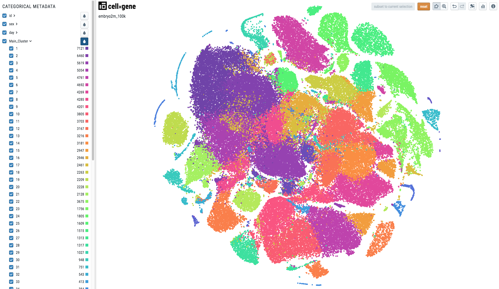
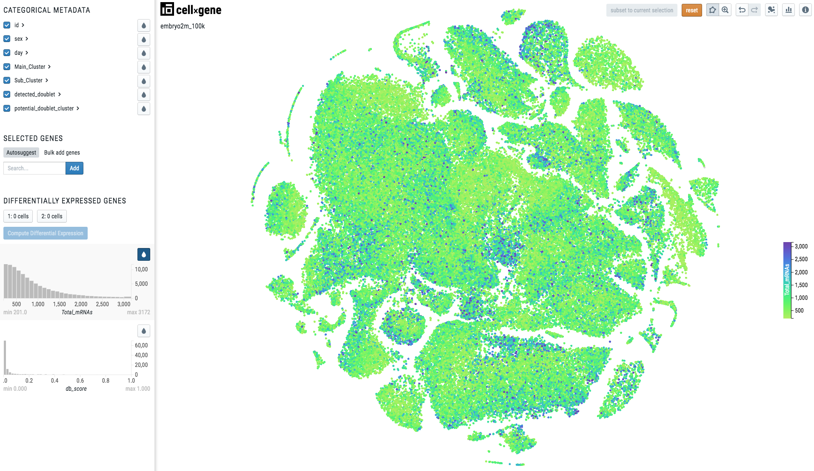

Single Cell Visualizations
==========================

Authors: `Batuhan Cakir <https://www.sanger.ac.uk/person/cakir-batuhan-1015271/>`_, `Simon Murray <https://www.sanger.ac.uk/people/directory/murray-simon>`_ and `Vladimir Kiselev <https://www.sanger.ac.uk/people/directory/kiselev-vladimir-yu>`_. 

If you would like to make your single-cell RNA-seq data publicly available on a website, for example as a supplement for a publication, we can help you with that!

cellxgene
---------

We use `cellxgene
<https://chanzuckerberg.github.io/cellxgene/>`_ to visualize single cell RNA-seq data. **cellxgene** is an interactive data explorer which is very scalable and flexible.

To be able for us to create a **cellxgene** website for your data we need to have your data in the `h5ad (AnnData) <https://anndata.readthedocs.io>`_ format. 

AnnData
-------

AnnData format usually contains the following slots:

- **X** contains the expression matrix.
- **obsm** contains the embeddings data.
- **obs** contains the cell metadata.
- **var** contains the gene metadata.

.. image:: img/visualisations/anndata.svg
   :width: 700

When you work with **cellxgene** you only need to modify two of the slots above: **obsm** and **obs**.

X slot
^^^^^^

It is recommended to store the expression matrix in ``CSR`` (compressed sparse row) format to create smaller files depending on sparsity of your data instead of ``CSC`` (compressed sparse column) format or dense Numpy array. 

To convert your expression matrix into the ``CSR`` format please use:

.. code-block:: python
    
    adata.X = scipy.sparse.csr_matrix(adata.X)

To convert your expression matrix into the Numpy array please use:

.. code-block:: python

    adata.X = scipy.sparse.csr_matrix.toarray(adata.X)

obsm slot
^^^^^^^^^

To visualize your cells in 2D **cellxgene** uses **obsm** slot. If there are multiple embeddings stored in this slot they will all be available on the web interface. 

.. note:: **cellxgene** requires that all of the embeddings' names are prefixed with ``X_``. For example, ``X_umap``, ``X_pca`` or ``X_some_embedding``.

obs slot
^^^^^^^^

To highlight and colour your cells **cellxgene** uses **obs** slot. The colouring will depend on the type of you cell metadata contained in the **obs** slot.

When the metadata is *categorical*, i.e. there is one colour per category, the visualization will look like this:

To make your cell metadata categorical please use the following code:

.. code-block:: python

    import pandas as pd
    adata.obs['metadata_name'] = pd.Categorical(adata.obs['metadata_name'])

When the metadata is *continuous*, the visualization will look like this:

.. note:: Note there is a continuous scale on the right side of the plot.

To make your cell metadata continuous please use the following code:

.. code-block:: python

    import numpy as np
    adata.obs['metadata_name'] = np.float32(adata.obs['metadata_name'])

Visium data
^^^^^^^^^^^

If your want to use cellxgene with **Visium data**, you need to follow these steps:

You can use ``scanpy.read_visium`` function to read from Space Ranger output folder and it will import everything needed to AnnData. Be careful that the images should contain one sample only. If not, you need to crop the other samples out.

The spatial embedding layer should be contained in ``obsm`` and be named ``X_spatial``. Other layers can exist, but only this one will have the spatial feature enabled.

.. code-block:: python

    adata.obsm['X_spatial'] = adata.obsm['spatial']
    del adata.obsm['spatial']

If you already have h5ad file before importing Visium and add spatial features from the Visium data that, you should transfer the same slots from the h5ad file created after you imported Visium data.

.. code-block:: python

    # adata is the original one, adata2 is the AnnData you imported to Python via `scanpy.read_visium`

    adata.uns['spatial'] = adata2.uns['spatial']
    adata.obsm['X_spatial'] = adata2.obsm['X_spatial']
    
Cell metadata (e.g. clustering) should be imported manually. You should use ``pandas.read_csv`` to add them, and change their type with ``.astype("category")`` if not continuous:

.. code-block:: python

    adata.obs['clustering_x'] = pandas.read_csv('clustering_x.csv', index_col = 'Barcode')
    adata.obs['clustering_x'] = adata.obs['clustering_x'].astype("category")
    
If you want to integrate your Cell2Location output to your h5ad file, you should add the cell abundance tables from csv or obsm slot to obs slot to be able to color your cells by cell abundances.
If you have csv files, you have to import csv to h5ad.

.. code-block:: python

    # if your cell abundance data are in csv files
    cell_abundance = pd.read_csv('/your/path/to/csv')
    adata.obs = pd.concat([adata.obs, cell_abundance], axis=1)
    adata.obsm['q05_cell_abundance_w_sf'] = pd.read_csv('/your/path/to/csv')
    
    # if your cell abundance data are in obsm slot
    adata.obs = pd.concat([adata.obs, adata.obsm['q05_cell_abundance_w_sf']], axis=1)

If you have cell abundance table in another h5ad, you can transfer it to main h5ad file:

.. code-block:: python

    adata.obs = pd.concat([adata.obs, adata2.obsm['q05_cell_abundance_w_sf']], axis=1)

You can check and download the notebook to make your Visium data compatible with cellxgene from Google Colab:  
https://colab.research.google.com/github/cellgeni/docs/blob/master/docs/source/visium_to_cxg.ipynb

Data Conversion
^^^^^^^^^^^^^^^

We have released the ``sceasy`` package on GitHub (https://github.com/cellgeni/sceasy) to easily convert other single-cell file types to AnnData format for visualization with cellxgene. Currently it supports converting **Seurat**, **SingleCellExperiment** and **Loom** objects to **AnnData**. By default it transfers expression matrices, cell and gene metadata table, and, if available, cell embeddings in reduced dimensions to **AnnData**. 

.. warning:: Before installing the conda packages below please first create a new conda environment ``EnvironmentName`` and activate it. Everything else can be installed in ``R``.

``sceasy`` is installable either as a ``bioconda`` package:

.. code-block:: python 

    conda install -c bioconda r-sceasy

or as an ``R`` package:

.. code-block:: r 

    devtools::install_github("cellgeni/sceasy")

To use ``sceasy`` ensure the ``anndata`` package (version has to be < 0.6.20) is installed:

.. code-block:: python 

    conda install anndata == 0.6.19  -c bioconda

In addition, please also ensure the ``loompy`` package (loompy version < 3.0.0) is installed:

.. code-block:: python

    conda install loompy == 2.0.17  -c bioconda

You will also need to install ``reticulate`` package:

.. code-block:: r

    install.packages('reticulate')

Finally, before converting your data please load the following libraries in your ``R`` session:

.. code-block:: r
    
    library(sceasy)
    library(reticulate)   
    use_condaenv('EnvironmentName')
    loompy <- reticulate::import('loompy')
    
Seurat to AnnData
~~~~~~~~~~~~~~~~~

.. code-block:: r
    
   sceasy:::convertFormat(seurat_object, from="seurat", to="anndata",
                          outFile='filename.h5ad')

Seurat to SingleCellExperiment
~~~~~~~~~~~~~~~~~~~~~~~~~~~~~~

.. code-block:: r

   sceasy:::convertFormat(seurat_object, from="seurat", to="sce",
                          outFile='filename.rds')

SingleCellExperiment to AnnData
~~~~~~~~~~~~~~~~~~~~~~~~~~~~~~~

.. code-block:: r
    
   sceasy:::convertFormat(sce_object, from="sce", to="anndata", 
                          outFile='filename.h5ad')

SingleCellExperiment to Loom
~~~~~~~~~~~~~~~~~~~~~~~~~~~~

.. code-block:: r

   sceasy:::convertFormat(sce_object, from="sce", to="loom",
                          outFile='filename.loom')

Loom to AnnData
~~~~~~~~~~~~~~~

.. code-block:: r

   sceasy:::convertFormat('filename.loom', from="loom", to="anndata",
                          outFile='filename.h5ad')

Loom to SingleCellExperiment
~~~~~~~~~~~~~~~~~~~~~~~~~~~~

.. code-block:: r

   sceasy:::convertFormat('filename.loom', from="loom", to="sce", 
                          outFile='filename.rds')

Examples
--------

We have already created a couple of websites for some of our programme members. You can have a look at them at the following links:

| `https://www.kidneycellatlas.org <https://www.kidneycellatlas.org/>`_
| `https://www.tissuestabilitycellatlas.org <https://www.tissuestabilitycellatlas.org/>`_
| `https://www.cvidcellatlas.org <https://www.cvidcellatlas.org/>`_
| `https://www.gutcellatlas.org <https://www.gutcellatlas.org/>`_
| `https://www.heartcellatlas.org <https://www.heartcellatlas.org/>`_
| `https://www.covid19cellatlas.org <https://www.covid19cellatlas.org/>`_
| `https://developmentcellatlas.cellgeni.sanger.ac.uk <https://developmentcellatlas.cellgeni.sanger.ac.uk/>`_
| `https://maternal-fetal-interface.cellgeni.sanger.ac.uk <https://maternal-fetal-interface.cellgeni.sanger.ac.uk/>`_
| `https://hemocytes.cellgeni.sanger.ac.uk <https://hemocytes.cellgeni.sanger.ac.uk/>`_
| `https://melanoma.cellgeni.sanger.ac.uk <https://melanoma.cellgeni.sanger.ac.uk/>`_

Demo
----

.. raw:: html

    <iframe width="560" height="315" src="https://www.youtube.com/embed/5Fg5admFe9M" frameborder="0" allow="accelerometer; autoplay; encrypted-media; gyroscope; picture-in-picture" allowfullscreen></iframe>

